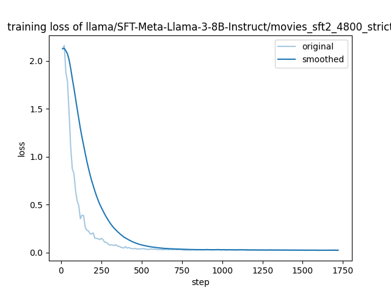

# llm_fine-tuning

需要用户自己去huggingface上下载Llama-3-8B，下载到model文件夹中

```bash
git clone https://github.com/Brynn-jx/llm_fine-tuning
conda create -n llama_factory python=3.10
conda activate llama_factory
cd LLaMA-Factory
pip install -e '.[torch,metrics]'
```

```bash
checkpoint 位于 LLaMA-Factory/llama/movies_sft2_4800_strict
```

训练代码如下

```bash
llamafactory-cli train \
    --stage sft \
    --do_train \
    --model_name_or_path /home/wjx/.cache/modelscope/hub/models/LLM-Research/Meta-Llama-3-8B-Instruct \
    --dataset movies_sft2 \
    --dataset_dir ./data \
    --template llama3 \
    --finetuning_type lora \
    --output_dir llama/SFT-Meta-Llama-3-8B-Instruct/movies_sft2_perfect \
    --overwrite_cache \
    --overwrite_output_dir \
    --cutoff_len 4096 \
    --preprocessing_num_workers 16 \
    --per_device_train_batch_size 1 \
    --gradient_accumulation_steps 8 \
    --lr_scheduler_type cosine \
    --logging_steps 10 \
    --warmup_steps 100 \
    --save_steps 200 \
    --eval_steps 200 \
    --learning_rate 5e-5 \
    --num_train_epochs 3.0 \
    --val_size 0.05 \
    --plot_loss \
    --fp16
```

```bash
llamafactory-cli webchat 
    --model_name_or_path /home/wjx/.cache/modelscope/hub/models/LLM-Research/Meta-Llama-3-8B-Instruct    
    --adapter_name_or_path  llama/SFT-Meta-Llama-3-8B-Instruct  
    --template llama3 
    --finetuning_type lora
```

